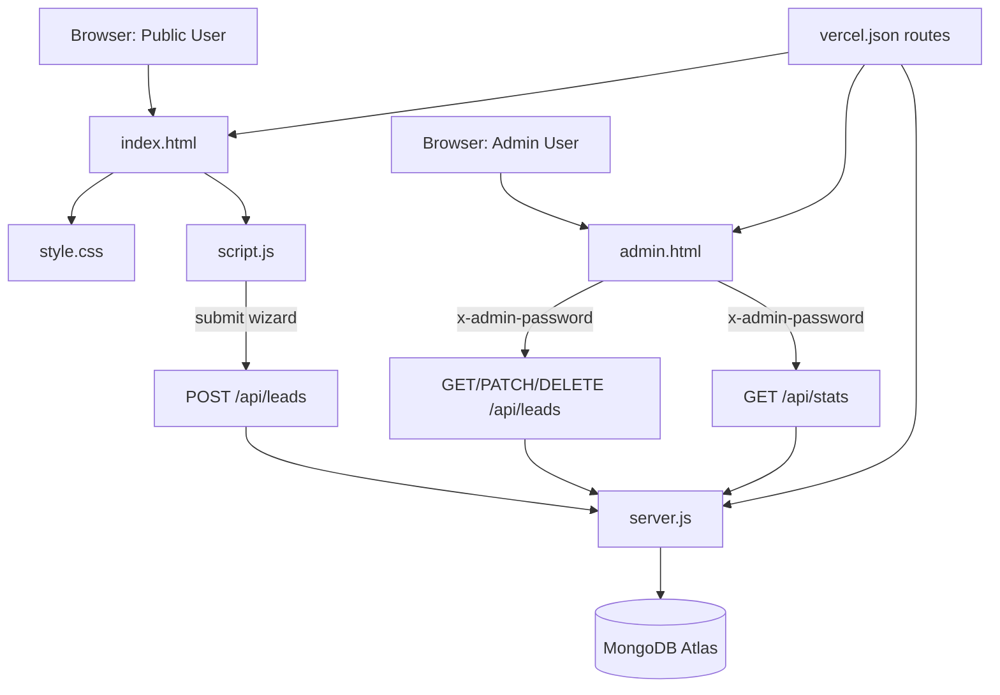

# Agent Handoff Map (Graphified)

Purpose: fast onboarding for any new agent working on this repo.

## 1) System Graph

## 2) File Ownership Map

- `index.html` - Public landing page structure, SEO metadata, section order, wizard markup, video blocks.
- `style.css` - Design system tokens, all public UI styling, responsive rules, wizard visuals.
- `script.js` - Public page behavior (carousel, nav, smooth scroll, counters, calculator formatting, wizard flow/submission).
- `admin.html` - Entire admin UI + inline logic (login, stats, leads table, drawer, CSV export).
- `server.js` - API, auth header checks, Mongo connection lifecycle, static page serving.
- `vercel.json` - Deployment routing and included static assets.
- `CODEX.md` - Deep project notes and conventions.
- `llms.txt` / `llms-full.txt` - AI-readable site guidance files.

## 3) Runtime Flows

### Public Lead Flow

1. User enters from hero/nav/about/calc CTA.
2. `script.js` opens wizard modal and collects step values from DOM.
3. Final submit sends `POST /api/leads`.
4. `server.js` validates/saves to Mongo `Lead` model.
5. Success screen appears in wizard.

### Admin CRM Flow

1. Admin opens `/admin` (UI gate).
2. Password checked by calling protected endpoint with `x-admin-password`.
3. Lead list and stats fetched from API.
4. Status/notes update via `PATCH`, deletes via `DELETE`.

## 4) Current UI Composition (Public Page)

Top-to-bottom major sections in `index.html`:

1. Navbar
2. Hero
3. Trust bar
4. About (Meet Mike)
5. Specialist video spotlight (`#specialist-video`)
6. Why Reverse
7. Calculator entry form
8. Process (`#how-it-works`)
9. Video guidance section (`#video-guidance`)
10. Testimonials carousel
11. FAQ
12. Compliance copy
13. Wizard modal

## 5) Edit Recipes (Quick Handoff)

- **Change public layout/sections** -> `index.html` + related styles in `style.css`.
- **Change spacing/theme/responsiveness** -> `style.css` only (check breakpoints at 1024/768/480).
- **Change wizard behavior or submit payload** -> `script.js` and maybe `server.js` schema/validation.
- **Change admin dashboard behavior** -> `admin.html` inline script.
- **Add new lead fields end-to-end** -> wizard markup + `script.js` payload + `server.js` schema + admin render/update paths.
- **Fix deploy routing/static issues** -> `vercel.json`.

## 6) Fragile/High-Risk Zones

- `script.js` wizard logic depends on specific IDs/classes in `index.html`.
- Carousel sizing depends on card width + gap recalculation.
- Admin is self-contained in one file; small changes can affect many behaviors.
- Serverless DB connect pattern in `server.js` should not be replaced with reconnect-per-request logic.
- Admin security is enforced server-side via `x-admin-password` check (UI login alone is not security).

## 7) Fast Validation Checklist

- Public page loads and no broken sections on desktop + mobile.
- Wizard opens from all CTAs and can submit successfully.
- `/admin` login works with header-auth-backed endpoints.
- Lead list/status update/delete works.
- `vercel.json` still routes static assets and API correctly.

## 8) Minimal Command Set for Next Agent

- Install: `npm install`
- Local run: `npm run dev` (or `npm start` depending on scripts)
- Lint/diagnostics: use editor diagnostics (no formal linter configured in this repo)

